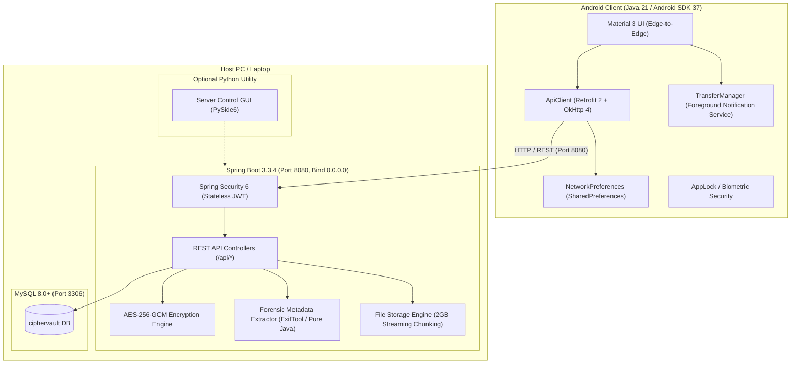

# CipherVault

> **Private, Self-Hosted Encrypted Cloud Vault**  
> Native Android Client (Material 3) + Spring Boot Core + Zero-Knowledge Architecture

---

## Overview

CipherVault is an end-to-end secure, private cloud storage solution built for high-security personal data custody. It combines an ultra-responsive native Android client adhering to Material You / Material 3 design principles with a resilient, high-throughput Spring Boot backend and an optional desktop Server Manager.

CipherVault safeguards your files with client-side isolation, envelope encryption, authenticated cryptography, and rich forensic metadata indexing without compromising user experience or network transfer speeds.

---

## System Architecture



---

## Core Features

- **Authenticated Payload Encryption**: AES-256-GCM zero-knowledge data encryption using PBKDF2 with 65,536 iterations for per-user cryptographic key derivation.
- **High-Capacity File Transfers**: Up to 2GB single-file streaming uploads and downloads with chunked progress reporting, speed calculation, ETA estimation, and foreground notification controls.
- **SHA-256 Deduplication**: Automatic cryptographic hash checking prevents redundant file uploads, conserving storage and network bandwidth.
- **Forensic Metadata Indexing**: Extracts camera make/model, lens, exposure, GPS, audio/video codecs, bitrates, and document tags with ExifTool support and pure Java fallback.
- **Self-Healing Connection Architecture**: Automatically validates server health on boot. Seamlessly connects via USB (ADB reverse), Android Studio Emulator, local Wi-Fi LAN, or mobile hotspot. If an IP changes, automatically routes to the Connection setup screen with diagnostic guidance.
- **Material 3 / Dynamic Colors**: Full edge-to-edge Android layout with Lucide vector iconography, upload staging area, in-app camera capture, and granular file search/sorting.

---

## Supported Connection Modes

CipherVault supports 4 distinct connection topologies out of the box:

| Mode | Android Host Setting | PC / Host Configuration | Speed & Stability | Best Used For |
| :--- | :--- | :--- | :--- | :--- |
| **1. USB / ADB Reverse** | `127.0.0.1:8080` | `adb reverse tcp:8080 tcp:8080` | **Fastest & Most Reliable** (No Wi-Fi needed) | Physical phone tethered to PC via USB cable |
| **2. Android Studio Emulator** | `10.0.2.2:8080` | None (handled by emulator virtual router) | **Fastest** (Internal loopback) | Development and testing inside Android Emulator |
| **3. Physical Phone on Wi-Fi** | `<PC_LAN_IP>:8080` | Inbound TCP 8080 allowed in Windows Firewall | **Very Fast** (Dependent on router) | Normal home / office Wi-Fi network |
| **4. Mobile Hotspot** | `<HOTSPOT_IP>:8080` | Connect PC Wi-Fi to phone's hotspot | **Fast & Isolated** (Field testing) | Environments without a shared Wi-Fi router |

---

## Quick Start (30-Second Launch)

### 1. Prerequisites Check
Ensure the following tools are installed on your workstation:
- **Java 21 LTS** (`java -version`)
- **MySQL 8.0+** (`mysql --version`)
- **Android Studio** (API 37 SDK Platform, Build-Tools 35.0.0)
- **Python 3.10+** (Optional, for Server Control desktop GUI)

### 2. Start MySQL
Ensure the MySQL service is active and the `ciphervault` database is created:
```sql
CREATE DATABASE IF NOT EXISTS ciphervault CHARACTER SET utf8mb4 COLLATE utf8mb4_unicode_ci;
CREATE USER IF NOT EXISTS '<MYSQL_USERNAME>'@'localhost' IDENTIFIED BY '<MYSQL_PASSWORD>';
GRANT ALL PRIVILEGES ON ciphervault.* TO '<MYSQL_USERNAME>'@'localhost';
FLUSH PRIVILEGES;
```

### 3. Launch Spring Boot Backend
Open a terminal in the project directory:
```powershell
cd backend
.\mvnw.cmd spring-boot:run
```
*The backend binds to `0.0.0.0:8080` to accept connections across all network adapters.*

### 4. Verify Health
In a separate terminal, verify backend subsystems are operational:
```powershell
curl http://localhost:8080/api/health
```
*Expected response: `HTTP 200 OK` with status `"UP"` and healthy components (`backend`, `database`, `storage`, `encryption`, `metadata`, `transfers`).*

### 5. Launch Android Client
- Open the `android/` directory in Android Studio.
- Connect your device or start an emulator.
- For USB-connected physical devices, run:
  ```powershell
  adb reverse tcp:8080 tcp:8080
  ```
- Build and run the app. If the connection screen appears, select the matching preset or enter the host address and tap **Save & Continue**.

---

## Project Structure

```text
CipherVault/
├── android/                   # Native Android application (Java 21, Gradle, Material 3)
│   ├── app/src/main/java/     # Activities, Fragments, Adapters, Network Clients, Services
│   ├── app/src/main/res/      # Layouts, Drawables (Lucide icons), Themes, Values
│   └── build.gradle           # Android Gradle configuration
├── backend/                   # Spring Boot 3.3.4 REST API & Cryptographic Engine
│   ├── src/main/java/         # Controllers, Entities, Repositories, Security, Storage
│   ├── src/main/resources/    # application.properties (Port 8080, DB settings, limits)
│   ├── mvnw.cmd               # Maven Wrapper for Windows
│   └── pom.xml                # Backend dependencies (Spring Security, JPA, MySQL, JJWT)
├── database/                  # Relational database resources
│   └── schema.sql             # Authoritative database schema & indexes
├── docs/                      # Comprehensive technical documentation
│   ├── HOW_TO_RUN.md          # Exhaustive step-by-step setup and operations guide
│   ├── CONNECTION.md          # Deep networking, firewall, and connection guide
│   ├── api/                   # REST API contracts & specifications
│   ├── architecture/          # High-level and module architecture documentation
│   ├── database/              # Schema design, foreign keys, and indexes
│   ├── security/              # Cryptographic model, key derivation, and token policies
│   └── setup/                 # Initial environment setup guide
├── server-control/            # Optional Python PySide6 Desktop Server Control Utility
│   ├── app/                   # PySide6 UI windows, widgets, and background threads
│   ├── main.py                # Server Control entry point
│   ├── requirements.txt       # Dependencies (PySide6, requests, psutil)
│   └── run.bat                # Windows launcher batch script
├── CIPHERVAULT_HOW_TO_RUN.txt # Plaintext quick-reference command cheat sheet
└── README.md                  # Project overview and entry point (this file)
```

---

## Detailed Documentation Guides

- [**Complete How-To-Run Manual**](file:///c:/Users/akhil/OneDrive/Desktop/CipherVault/docs/HOW_TO_RUN.md): Step-by-step guide from zero to a running cluster, covering manual server launch, GUI launcher, unit testing, APK compilation, and graceful teardown.
- [**Connection & Networking Guide**](file:///c:/Users/akhil/OneDrive/Desktop/CipherVault/docs/CONNECTION.md): Complete reference on USB ADB reverse, Emulator, Wi-Fi LAN, Hotspot setups, Windows Firewall configuration, and connection failure troubleshooting.
- [**API Specification**](file:///c:/Users/akhil/OneDrive/Desktop/CipherVault/docs/api/API_SPECIFICATION.md): Full documentation of all authentication, file storage, transfer, and health REST endpoints.
- [**Security Model**](file:///c:/Users/akhil/OneDrive/Desktop/CipherVault/docs/security/SECURITY_MODEL.md): Technical deep-dive into the AES-256-GCM encryption architecture and PBKDF2 key schedule.
- [**Database Schema**](file:///c:/Users/akhil/OneDrive/Desktop/CipherVault/docs/database/DATABASE_SCHEMA.md): Relational tables, indexing strategy, and constraints.
