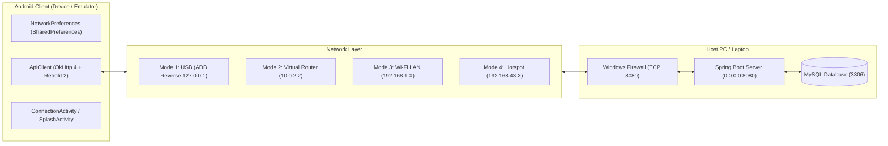
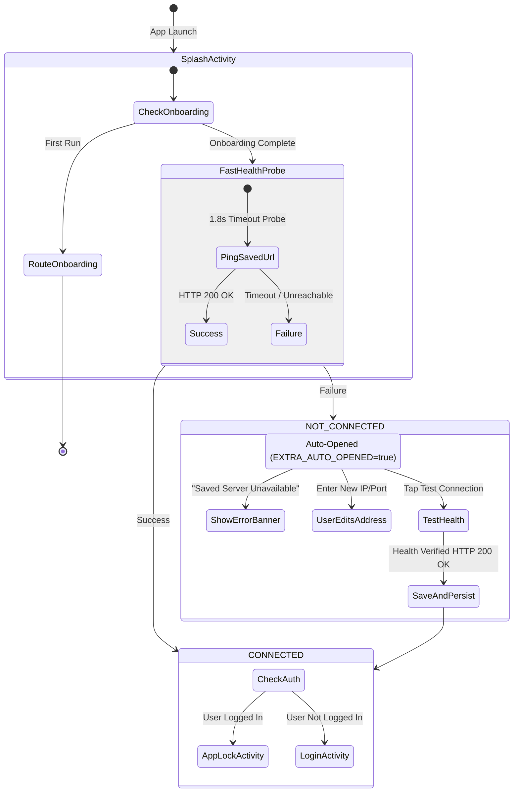

# CipherVault — Network Architecture, Connection Modes & Troubleshooting Guide

> **Authoritative Network Integration Manual**  
> Complete technical reference for Android-to-Backend networking, USB ADB reverse tunneling, local Wi-Fi routing, mobile hotspots, firewall configuration, connection state handling, and forensic troubleshooting.

---

## Table of Contents

1. [Network Architecture Overview](#1-network-architecture-overview)
2. [Supported Connection Modes](#2-supported-connection-modes)
   - [Mode 1: USB Cable with ADB Reverse (Recommended for Desktop Dev)](#mode-1-usb-cable-with-adb-reverse-recommended-for-desktop-dev)
   - [Mode 2: Android Studio Emulator](#mode-2-android-studio-emulator)
   - [Mode 3: Physical Device on Same Local Wi-Fi Network (LAN)](#mode-3-physical-device-on-same-local-wi-fi-network-lan)
   - [Mode 4: Mobile Hotspot Mode (Field / Standalone Testing)](#mode-4-mobile-hotspot-mode-field--standalone-testing)
3. [Windows Firewall Configuration](#3-windows-firewall-configuration)
4. [Android Connection Screen Interface](#4-android-connection-screen-interface)
5. [Connection Lifecycle & State Machine](#5-connection-lifecycle--state-machine)
   - [Connected State: Zero-Click Fast Path](#connected-state-zero-click-fast-path)
   - [Disconnected State: Automatic Self-Healing Recovery](#disconnected-state-automatic-self-healing-recovery)
   - [Verification-First Persistence Policy](#verification-first-persistence-policy)
6. [Troubleshooting Decision Matrix & Recovery Trees](#6-troubleshooting-decision-matrix--recovery-trees)
7. [Verification & Diagnostic Commands](#7-verification--diagnostic-commands)

---

## 1. Network Architecture Overview

CipherVault operates on a decoupled client-server architecture where the Android client interacts with the Spring Boot backend over HTTP REST and streaming multipart protocols.



### Key Technical Parameters:
- **Server Bind Address**: `server.address=0.0.0.0` (Spring Boot listens on all IPv4 network interfaces simultaneously).
- **Server Port**: `server.port=8080`.
- **Client Base URL Storage**: Stored in private app `SharedPreferences` under the file name `CipherVaultNetwork` with key `server_base_url`. Sensitive credentials are never stored in network preferences.
- **Client Timeout Specifications**:
  - *Standard Transfers*: Connect 30s, Read 180s, Write 180s.
  - *Fast Splash Probe*: Connect 1.8s, Read 1.8s (prevents app launch lag).
  - *Connection Test Probe*: Connect 3.5s, Read 3.5s (in `ConnectionActivity`).

---

## 2. Supported Connection Modes

### Mode 1: USB Cable with ADB Reverse (Recommended for Desktop Dev)

The most resilient and reliable method for testing on a physical Android phone. It routes Android loopback traffic over the physical USB cable directly into the workstation, bypassing Wi-Fi routers and local firewalls.

#### Prerequisites:
1. Enable **Developer Options** and **USB Debugging** on the Android device.
2. Connect the phone to your computer via USB.
3. Ensure ADB recognizes the device:
   ```powershell
   adb devices
   ```

#### Tunnel Configuration:
Execute the reverse port forwarding command in a terminal:
```powershell
adb reverse tcp:8080 tcp:8080
```
*This instructs the Android OS to route any outbound TCP connection to `127.0.0.1:8080` or `localhost:8080` back through ADB to port 8080 on the host PC.*

#### In-App Settings:
- **Server IPv4**: `127.0.0.1` (or `localhost`)
- **Port**: `8080`
- Tap **Test Connection** -> Latency is typically under 15ms!

---

### Mode 2: Android Studio Emulator

The Android Studio emulator runs inside a virtualized environment. The virtual router in the emulator maps host loopback (`127.0.0.1`) to the alias `10.0.2.2`.

#### In-App Settings:
- Tap the **Emulator (10.0.2.2)** preset chip on the connection screen.
- Or enter:
  - **Server IPv4**: `10.0.2.2`
  - **Port**: `8080`
- Tap **Test Connection** -> Connected immediately.

---

### Mode 3: Physical Device on Same Local Wi-Fi Network (LAN)

When testing wirelessly across a home or office Wi-Fi network where both the PC and Android device are connected to the same router.

#### Step 1: Find PC's Local IPv4 Address
In a PowerShell terminal on your PC:
```powershell
ipconfig
```
Locate the **Wireless LAN adapter Wi-Fi** section and note the `IPv4 Address` (e.g. `192.168.1.75`).

#### Step 2: Open Port 8080 in Windows Firewall
*(See [Section 3: Windows Firewall Configuration](#3-windows-firewall-configuration) below).*

#### Step 3: Enter Address in CipherVault
- Open CipherVault on your phone.
- In `ConnectionActivity`, enter:
  - **Server IPv4**: `192.168.1.75` (your PC's actual LAN IP)
  - **Port**: `8080`
- Tap **Test Connection**.

---

### Mode 4: Mobile Hotspot Mode (Field / Standalone Testing)

Ideal for environments where no external Wi-Fi router is available, or when router client isolation prevents peer-to-peer connections.

#### Setup Procedure:
1. Turn on **Personal Hotspot** on your Android smartphone.
2. Connect your PC / laptop Wi-Fi to your phone's personal hotspot.
3. In a terminal on the PC, run `ipconfig` and find the IP assigned to your laptop (usually within `192.168.43.X` on Android).
4. In CipherVault on your phone:
   - Tap the **Hotspot (192.168.43.)** quick chip to prefill the subnet prefix.
   - Enter the last octet of your PC's IP.
   - Tap **Test Connection**.

---

## 3. Windows Firewall Configuration

Windows Defender Firewall blocks incoming TCP connections by default on private and public networks. For wireless modes (Mode 3 and Mode 4), you must create an inbound firewall rule allowing traffic on TCP port `8080`.

### 3.1 Create Inbound Rule (One-Time Setup)
Open PowerShell as **Administrator** and run:
```powershell
netsh advfirewall firewall add rule name="CipherVault Backend" dir=in action=allow protocol=TCP localport=8080
```

### 3.2 Verify the Rule
```powershell
netsh advfirewall firewall show rule name="CipherVault Backend"
```

### 3.3 Remove the Rule (If needed later)
```powershell
netsh advfirewall firewall delete rule name="CipherVault Backend"
```

---

## 4. Android Connection Screen Interface

The CipherVault Connection Screen (`ConnectionActivity`) is built to adhere to Material 3 guidelines and handles user entry, sanitization, real-time testing, and atomic persistence.

### UI Controls:
- **Server IPv4 (`etServerIp`)**: Accepts dotted-decimal IPv4 addresses. Automatically strips `http://`, `https://`, trailing slashes, and port segments if pasted from clipboard.
- **Server Port (`etServerPort`)**: Pre-populated with `8080`. Enforces numeric boundary checks `1` through `65535`.
- **Paste Clipboard Button (`btnPasteClipboard`)**: Quick paste with automatic URL cleanup and auto-test trigger.
- **Quick Preset Chips**:
  - `chipHotspot`: Pre-fills `192.168.43.` for fast hotspot entry.
  - `chipEmulator`: Pre-fills `10.0.2.2:8080` and triggers immediate health check.
- **Test Connection (`btnTestConnection`)**: Sends a live `GET /api/health` probe via Retrofit, measures round-trip latency in milliseconds, and displays a dynamic green/red status badge.
- **Save & Continue (`btnSaveConnection`)**: Saves the server configuration and proceeds to Login or App Lock.

---

## 5. Connection Lifecycle & State Machine



### Connected State: Zero-Click Fast Path
1. When the app launches, `SplashActivity` reads the saved `server_base_url` from `CipherVaultNetwork` SharedPreferences.
2. It sends an unauthenticated background probe (`ApiClient.checkHealthFast(...)`) to `GET /api/health` with a 1.8-second timeout.
3. If the probe returns `HTTP 200 OK`:
   - The connection screen is **completely bypassed**.
   - If the user has a valid session: navigates immediately to `AppLockActivity` (biometric/PIN unlock).
   - If the user is logged out: navigates immediately to `LoginActivity`.

### Disconnected State: Automatic Self-Healing Recovery
1. If the server is offline, the laptop is sleeping, or the network changed:
   - The probe fails or reaches the 2.5-second safety fallback.
2. `SplashActivity` automatically launches `ConnectionActivity` with `EXTRA_AUTO_OPENED = true` and `EXTRA_FAILED_URL`.
3. The Connection Screen highlights:
   - **Status Title**: `Saved Server Unavailable` (in Material red).
   - **Target Banner**: Shows the previous URL that failed.
   - **Guidance Message**: Explains that the server is unreachable, and advises checking network connectivity or updating the IP address.
4. The user can update the IP and tap **Test Connection** to immediately verify recovery.

### Verification-First Persistence Policy
In `ConnectionActivity.java`:
- The app **strictly refuses** to overwrite a working server configuration with an unverified address.
- Tapping **Save & Continue** with an untested address triggers an automatic background health check first.
- Only if `response.isSuccessful()` (HTTP 200 OK) will `NetworkPreferences.saveBaseUrl(...)` persist the new URL.
- If the test fails, the previous working address is preserved and an informative error toast is displayed.

---

## 6. Troubleshooting Decision Matrix & Recovery Trees

Use the following troubleshooting guide to resolve connectivity issues quickly:

| Error Symptom / Log Output | Root Cause | Exact Resolution |
| :--- | :--- | :--- |
| **`Connection refused`** (`ConnectException`) | Spring Boot backend is not running, or listening on a different port. | 1. Open terminal in `backend/`.<br>2. Run `.\mvnw.cmd spring-boot:run`.<br>3. Verify terminal says `Tomcat started on port 8080`. |
| **`Connection timed out`** (`SocketTimeoutException` after 3500ms) | Windows Firewall is dropping packets, or devices are on different subnets. | 1. Ensure PC and phone are on the same Wi-Fi.<br>2. Run Firewall command: `netsh advfirewall firewall add rule name="CipherVault Backend" dir=in action=allow protocol=TCP localport=8080`.<br>3. Check if PC IP changed via `ipconfig`. |
| **`No route to host`** / Network unreachable | PC Wi-Fi disconnected or router client isolation enabled. | 1. Check Wi-Fi connection on both devices.<br>2. If on guest Wi-Fi, switch to **Mode 4 (Mobile Hotspot)** or **Mode 1 (USB ADB Reverse)**. |
| **`adb reverse` not connecting on USB** | ADB reverse tunnel has not been created or was cleared by phone reconnect. | 1. Run `adb devices` to ensure phone is detected.<br>2. Run `adb reverse tcp:8080 tcp:8080`.<br>3. In app, set host to `127.0.0.1:8080`. |
| **`HTTP 401 Unauthorized` during health check** | Client hit `/actuator/health` or `/api/files` instead of `/api/health`. | Ensure test endpoint is `GET /api/health` (publicly allowed in `SecurityConfig.java`). |
| **`Database ERROR` in Health JSON response** | MySQL service stopped or credentials in `application.properties` mismatch. | 1. Start MySQL: `net start MySQL80`.<br>2. Verify user privileges in MySQL: `GRANT ALL PRIVILEGES ON ciphervault.* TO '<MYSQL_USERNAME>'@'localhost';`. |
| **`Invalid IPv4 address` on save** | Address entered in malformed notation (e.g. missing octet or letters). | Enter standard dotted-decimal notation (e.g. `192.168.1.100`), or tap a preset chip. |

---

## 7. Verification & Diagnostic Commands

Run these terminal commands from your PC to diagnose connectivity before testing on the phone:

### 7.1 Verify Backend Port is Open on Workstation
```powershell
Test-NetConnection -ComputerName 127.0.0.1 -Port 8080
```
*Expected: `TcpTestSucceeded : True`*

### 7.2 Verify Backend Listens on All Interfaces (`0.0.0.0`)
```powershell
Get-NetTCPConnection -LocalPort 8080 | Format-Table LocalAddress, LocalPort, State, OwningProcess
```
*Expected: `LocalAddress: 0.0.0.0`, `LocalPort: 8080`, `State: Listen`*

### 7.3 Verify Active ADB Reverse Tunnels
```powershell
adb reverse --list
```
*Expected: `(reverse) tcp:8080 tcp:8080`*

### 7.4 Test Backend Health from PC Terminal
```powershell
Invoke-RestMethod -Uri "http://localhost:8080/api/health" -Method Get | ConvertTo-Json
```
